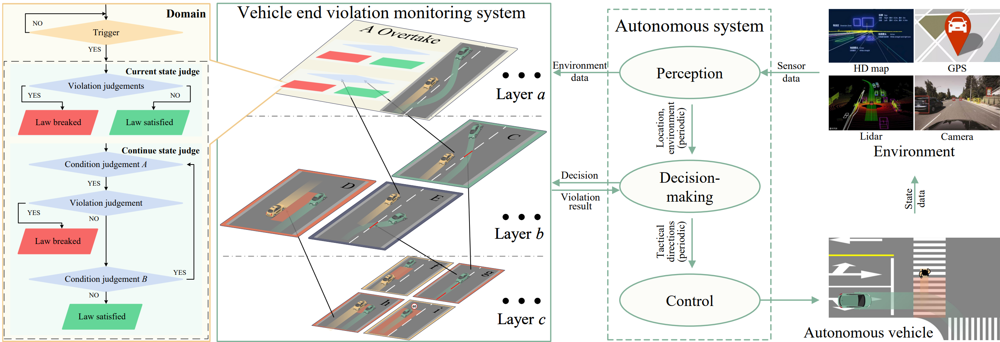
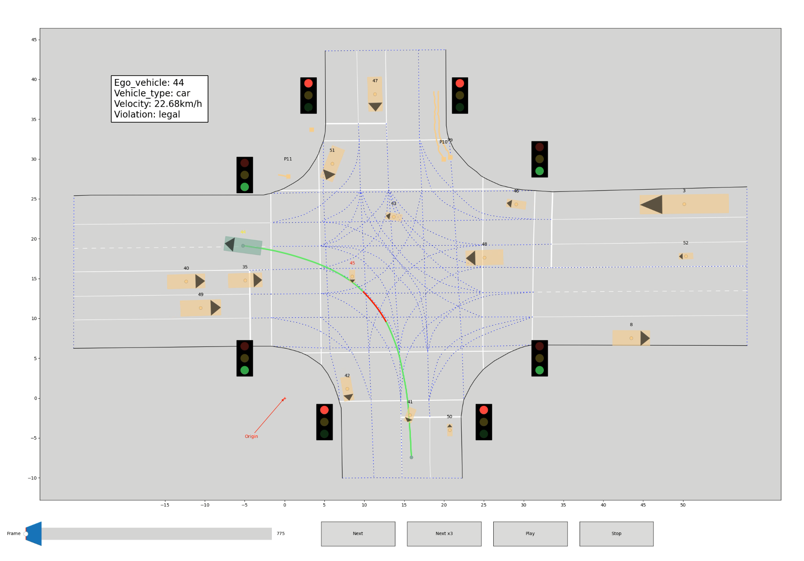

# Digitalization of Traffic Law
## Introduction
Safety is the primary issue facing the commercialization of autonomous vehicles,traffic laws are a powerful means of ensuring vehicle safety and important evidence for the traceability of accidents. However, the ambiguity of language laws for human drivers and the complexity of dynamic and static multi-constraint coupling scenarios bring severe challenges to compliance research and are the key problems hindering the safe development of autonomous driving. This research intends to start with the research on the systematic digitalization of traffic laws, explore the influence filed of vehicle behaviors, select the reasonable compliance judgment thresholds, and then research the real-time compliance monitoring methods.

 

## Relevant research contents

1) We classified and refined [25 articles related to driving](https://github.com/SOTIF-AVLab/Digitalization-of-regulations/tree/main/article.pdf) in the regulations for the implementation of the road traffic safety law of the people's Republic of China, explored the semantic logic and constraint types of road regulations, defined atomic propositions, and built a multi-level trigger domain digital description model of regulations by building MTL formulas;
2) Build a real-time monitoring model of vehicle compliance based on the constraints of digital road regulations;
3) Based on the Chinese data set, the impact field of vehicle behavior with Chinese characteristics is explored, the compliance judgment threshold selection strategy is given, and the rationality and consistency of compliance monitoring and decision-making are verified.

 

## Demo and instructions
We provide the monitoring program code of highway and intersection related rules written in MATLAB. At the same time, we also provide a visualization program of the relevant data set, so that the compliance monitoring results of vehicles in the data set can be replayed. Please see the [Highway_Vis_tool](https://github.com/SOTIF-AVLab/Digitalization-of-regulations/tree/main/Highway_Vis_tool) or [Intersection_Vis_tool](https://github.com/SOTIF-AVLab/Digitalization-of-regulations/tree/main/Intersection_Vis_tool) to get more detailed information about them.

A demo video of the monitoring visualization of highway dataset can be viewed on [Youtube](https://youtu.be/s39px3G_MT8) or [BiliBili](https://www.bilibili.com/video/BV1JV4y1u7AW/?vd_source=682b18deece45270539ce306454dc47f).

A demo video of the monitoring visualization of intersection dataset can be viewed on [Youtube](https://youtu.be/zstEGSWjF5A) or [BiliBili](https://www.bilibili.com/video/BV1QB4y1E7KZ/?vd_source=682b18deece45270539ce306454dc47f).

 

 

## Acknowledgements
Our highway visualization code is built upon the public code of visualization program of [HighD-dataset](https://github.com/RobertKrajewski/highD-dataset). The dataset we use is derived from DJI's open-source dataset——AD4CHE(Aerial Dataset for China Congested Highway and Expressway).

For intersection, the dataset we use is [SinD-dataset](https://github.com/SOTIF-AVLab/SinD). Our intersection visualization code is built upon the public code of visualization program of SinD-dataset.

## Organization

- School of Vehicle and Mobility, Tsinghua University
- Tsinghua Intelligent Vehicle Design and Safety Research Institute
- Safety Of The Intended Functionality（SOTIF） Research Team
